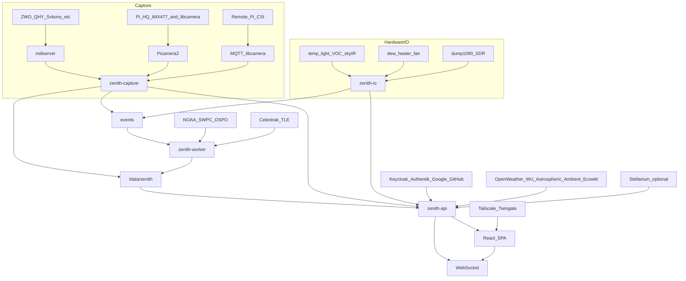

# Zenith all-sky camera

Zenith is a from-scratch all-sky stack for `acmeastro@10.0.0.52` (Pi 5, NVMe, Raspberry Pi HQ / IMX477). Develop native on the Pi first; containerize after capture, products, and the UI are stable. Target **AllSky + indi-allsky feature parity**, with a modern React science UI, schema-driven settings, named satellite tracking, meteor highlight reels, hardware I/O, weather APIs, and SSO behind Tailscale/Twingate.

## Stack (locked)

| Layer | Choice | Why |
| --- | --- | --- |
| Backend language | Python 3.12 | Picamera2, OpenCV, astropy, INDI, and science libs live here |
| API | **FastAPI** + Uvicorn | Async, WebSockets, OpenAPI, Pydantic settings |
| Settings / validation | **Pydantic v2** | One schema drives config file, API, and the Settings page |
| Cameras | `CameraBackend` ABC | **Picamera2** (local CSI), **INDI / pyindi-client** (USB vendors), **MQTT libcamera** (remote Pi), simulator |
| Images / science | NumPy, Pillow, OpenCV, astropy, skyfield, ffmpeg | Capture, products, orbits, timelapses |
| Database | SQLite + SQLAlchemy | Index images, detections, time-series; files stay on disk |
| Auth | Authlib OIDC | Keycloak, Authentik, Google, GitHub |
| Frontend | **React 19 + TypeScript + Vite** | SPA that can sit on the Pi; no SSR |
| UI | Tailwind CSS + shadcn-style components | Dark science dashboard, not a 2016 admin theme |
| Charts | Apache ECharts + uPlot | ECharts for dashboards; uPlot for high-rate telemetry |
| Live | WebSocket JPEG + JSON telemetry | MJPEG fallback; WebRTC later if needed |
| Packaging | systemd first, then Docker Compose | Privileged capture + `/data/zenith` volume |

Local WSL runs a **simulator camera**. Real capture and GPIO run on `acmeastro`.

## Architecture



Four processes, one shared data directory:

1. **`zenith-capture`** — owns one `CameraBackend` at a time (INDI, Picamera2, or MQTT). Day/night profiles, JPEG (+ optional FITS/DNG), latest frame + metadata. `indiserver` is a sibling process, not in-process.
2. **`zenith-io`** — sensors, dew heater, fan, optional ADS-B client. Never touches the camera.
3. **`zenith-worker`** — keograms, startrails, timelapses, panorama, detection, clips, TLE propagation, NOAA polls, YouTube upload.
4. **`zenith-api`** — REST + WebSocket, settings, archive, OIDC, Stellarium import.

**Night dating:** a night is sunset day D through sunrise day D+1, stored as `nights/YYYY-MM-DD/`. Daytime images live under `days/YYYY-MM-DD/`.

```
/data/zenith/
  config.yaml
  zenith.db
  nights/2026-08-14/{raw,jpeg,thumbs,detections,clips}/
  days/2026-08-15/{jpeg,thumbs}/
  products/2026-08-14/
    keogram.jpg
    keogram_realtime.jpg
    startrails.jpg
    timelapse.mp4
    panorama.mp4
    mini.mp4
    meteors.mp4
    satellites.mp4
  tle/
  darks/
  overlays/
  logs/
```

Phase 1 runs capture as an asyncio task inside the API process. Split into systemd units once the loop is stable.

## Capture and day/night

Use sun altitude from site lat/lon/elevation. Modes: **day**, **twilight**, **night**, **moon** (night + bright moon up → lower gain).

Do **not** rely on libcamera auto-exposure at night. Mean-target AE lives in Zenith so every camera vendor behaves the same.

## Camera support (INDI + libcamera + MQTT)

INDI is the multi-vendor USB layer. Picamera2 is preferred for local Pi CSI (live + long exposure on Pi 5). MQTT-libcamera is for a remote Pi that owns its own camera.

**INDI vendors:** ZWO, Svbony, QHY, Player One, ToupTek, Altair, Omegon Pro, OGMA, Starlight Xpress, plus any INDI CCD.

**libcamera modules:** HQ IMX477 (dev camera), IMX378, Module v3 IMX708, AI IMX500, IMX678 Darksee, IMX283, IMX519, IMX335, IMX462, IMX327, 64MP HawkEye IMX682, 64MP OwlSight OV64A40, other libcamera modules.

**MQTT remote:** HQ, IMX378, Module v3, OwlSight.

## Feature catalog

Live view, archive, realtime / nightly / long-term keograms, startrails (ADU **and** star metrics), daily timelapse (full-night backup), mini timelapse, meteor event clips + highlight reel, thumbnails, fisheye→panorama + panorama timelapse, YouTube upload, overlays (cardinals, moon illumination, named satellites, ADS-B), darks, focus mode, SQM, aurora/Kp/Ovation, wildfire smoke, weather APIs (OpenWeather, WU, Astrospheric, Ambient, Ecowitt), dew heater + fan, sensor HAL, MQTT/HA, OIDC SSO, Tailscale/Twingate-friendly bind/trust-proxy.

See the original planning notes in this file’s sections below for settings fields, meteor vs RMS, and hardware chip lists.

## Schema-driven settings

Every setting is defined once in Pydantic. The Settings page is generated from JSON Schema: groups, units, min/max, and a description next to each control.

## Science we can do with this camera

Standard all-sky science (SQM, star-count cloudiness, aurora probability, satellite photometry, fireball tagging, long-term keograms as climate-of-the-sky) is already in the product plan. These are the research angles that go beyond “pretty pictures.”

### Proven / high value

- **Sky quality time series** — calibrated SQM vs moon phase, clouds, and wildfire smoke; publish as CSV/Parquet for observatory scheduling.
- **Cloud climatology** — star count + MLX90614 sky IR + weather API dewpoint as a three-way cloud sensor.
- **Aurora vs airglow** — keogram columns as a 1-D atmospheric spectrogram; Kp and Ovation as labels.
- **Satellite photometry** — named TLE objects + measured trail brightness (Starlink brightness studies).
- **Fireball statistics** — rate vs solar longitude, after ADS-B rejection.

### Anaconda (Python) classification stack

Ship an optional `environment-science.yml` later (does not run on the capture hot path):

- **scikit-learn / XGBoost / LightGBM** — tabular classifier on each detection: length, speed (px/s), curvature, brightness profile, persistence across frames, angular distance to nearest ADS-B, angular distance to nearest TLE, star-count residual, sky-IR.
- **astroML / photutils / sep** — source extraction, PSF, crowding; treat the dome as a wide-field catalog every frame.
- **umap-learn + HDBSCAN** — unsupervised clusters of “things that crossed the sky” so new classes appear before we name them.
- **PyTorch (optional, off-Pi)** — small CNN on 128×128 streak crops; train on the desktop, export ONNX, infer on the Pi.

### R / tidyverse companion (the “never really done on all-sky” layer)

Most all-sky projects stop at OpenCV line detection. Almost nobody treats a zenith camera as a **longitudinal ecological / epidemiological instrument**. An RStudio project against Zenith’s Parquet export can:

- **`tidymodels` + `ranger` / `xgboost`** — same fused streak classifier, with proper cross-validation by *night* (not by frame) so we do not leak weather.
- **`forecast` / `fable` / `prophet`** — forecast SQM and cloudiness hours ahead from the camera’s own history (observatory “should I open?”).
- **`mgcv` GAMs** — smoothness of sky brightness vs sun altitude, moon altitude, and aerosol; detect light-pollution regime changes when a new warehouse LED goes in.
- **`spatstat`** — meteor radiants as a spatial point process on the sky; aircraft as a covariate field from ADS-B.
- **`vegan` (the crazy one)** — treat detected stars as a **species community**. Each night is a sample; clouds are a disturbance. NMDS / Shannon diversity of the star field is a single number for “how much universe was visible.” All-sky cameras have not been used this way. It is slightly unhinged and scientifically defensible.
- **`signal` / `forecast` on keogram rows** — airglow waves (gravity waves) as periodic structure in the keogram; classify nights as wave / aurora / cloud / calm.

### The flagship crazy idea: fused sky-object taxonomy

Build a labeled dataset Zenith already has the sensors for:

| Feature source | Example features |
| --- | --- |
| Image | streak length, position angle, curvature, head/tail brightness, duration |
| ADS-B | nearest aircraft angular error, callsign |
| TLEs | nearest satellite, name, range, expected mag |
| Environment | SQM, star count, Kp, sky-IR, humidity |
| Time | solar longitude, moon alt, hour angle |

Classes: `meteor`, `fireball`, `aircraft`, `satellite`, `starlink_train`, `cosmic_ray`, `bug_or_bat`, `lens_flare`, `cloud_edge`, `unknown`.

No public all-sky package currently **joins** computer vision + ADS-B + TLEs + space weather + thermal sky into one classifier and then analyzes it in R as a nightly ecological sample. That is a paper, not a filter.

Pipeline: Zenith writes `detections.parquet` → Anaconda notebook trains ONNX → worker tags live frames → R Markdown monthly report (`targets` pipeline) for science.

## Implementation phases

**Phase 1 (this build)** — skeleton that sees the sky: simulator + Picamera2, capture loop, WebSocket live, schema-driven Settings, deploy script for `acmeastro`.

**Phase 2** — archive, keograms, startrails, timelapses, overlays, thumbnails.

**Phase 3** — satellites (Celestrak + Stellarium import), meteor clips + highlight reel, panorama.

**Phase 4** — SQM, aurora/smoke, weather, sensors, dew/fan, ADS-B, YouTube, MQTT.

**Phase 5** — OIDC, Tailscale/Twingate, INDI + MQTT camera backends, Docker.

**Phase 6 (science)** — Parquet export, optional conda env, R companion project, fused classifier.
